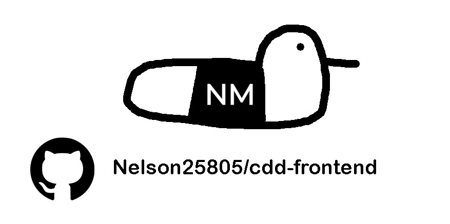

<!-- Improved compatibility of back to top link: See: https://github.com/othneildrew/Best-README-Template/pull/73 -->
<a id="readme-top"></a>

<!-- PROJECT SHIELDS -->
<!--
*** I'm using markdown "reference style" links for readability.
*** Reference links are enclosed in brackets [ ] instead of parentheses ( ).
*** See the bottom of this document for the declaration of the reference variables
*** for contributors-url, forks-url, etc. This is an optional, concise syntax you may use.
*** https://www.markdownguide.org/basic-syntax/#reference-style-links
-->
[![Contributors][contributors-shield]][contributors-url]
[![Forks][forks-shield]][forks-url]
[![Stargazers][stars-shield]][stars-url]
[![Issues][issues-shield]][issues-url]
[![project_license][license-shield]][license-url]
[![LinkedIn][linkedin-shield]][linkedin-url]

<!-- PROJECT LOGO -->
<br />
<div align="center">
  <a href="https://github.com/Nelson25805/cdd-frontend">
    
  </a>

<h3 align="center">CDD Frontend</h3>

  <p align="center">
    An application to search for games using the IGDB API.
    <br />
    <a href="https://github.com/Nelson25805/cdd-frontend"><strong>Explore the docs »</strong></a>
    <br />
    <br />
    <a href="https://github.com/Nelson25805/cdd-frontend">View Demo</a>
    &middot;
    <a href="https://github.com/Nelson25805/cdd-frontend/issues/new?labels=bug&template=bug-report---.md">Report Bug</a>
    &middot;
    <a href="https://github.com/Nelson25805/cdd-frontend/issues/new?labels=enhancement&template=feature-request---.md">Request Feature</a>
  </p>
</div>

<!-- TABLE OF CONTENTS -->
<details>
  <summary>Table of Contents</summary>
  <ol>
    <li>
      <a href="#about-the-project">About The Project</a>
      <ul>
        <li><a href="#built-with">Built With</a></li>
      </ul>
    </li>
    <li>
      <a href="#getting-started">Getting Started</a>
      <ul>
        <li><a href="#installation">Installation</a></li>
      </ul>
    </li>
    <li><a href="#usage">Usage</a></li>
    <!-- <li><a href="#roadmap">Roadmap</a></li> -->
    <li><a href="#contributing">Contributing</a></li>
    <li><a href="#license">License</a></li>
    <li><a href="#contact">Contact</a></li>
  </ol>
</details>

<!-- ABOUT THE PROJECT -->
## About The Project

![Project Name Screen Shot][project-screenshot]

`cdd-frontend` is the React single-page application that provides the user interface for the CDD project. It focuses on an intuitive UI for collectors to find, organize, discuss, trade, and wish for video games.

### Key Features

- CDD stands for Collect, Discover, Discuss — the three primary actions this app enables for game collectors.

- Search games (IGDB + user-submitted entries) and view rich game details.

- Add games to your collection with metadata: estimated value, condition/status, completion state, console/platform, notes.

- Maintain a wishlist — select desired consoles for each wish item.

- Add other users as friends and privately message them.

- View other friends wishlist's and collections of games

- Admin UI elements (report hooks and dashboard views) to inspect site metrics such as total users, most-wished-for games, top collectors, etc. (backend required; UI elements shown where applicable).

- Supabase is used for authentication, real-time DB operations, and storage of user & collection data.

This README covers **frontend** setup and usage. Backend (API, database, auth, IGDB integration) is documented separately.

<p align="right">(<a href="#readme-top">back to top</a>)</p>

  ### Built With

| Badge | Description |
|:-----:|-------------|
| [][React-url] | UI library. |
| [][Vite-url] | Dev server + bundler. |
| [][Supabase-url] | Authentication, database (Postgres), and realtime features. |
| [][cdd-backend-url] | Server layer which handles IGDB integration, additional API logic, and server-only secrets. |
|  | General styling solution |

<p align="right">(<a href="#readme-top">back to top</a>)</p>

<!-- GETTING STARTED -->
## Getting Started

### Installation

1. Clone the repo:
```sh
   git clone https://github.com/Nelson25805/cdd-frontend.git
   ```
```sh
   cd cdd-frontend
   ```

2. Install dependencies:
```sh
   npm install
   ```
or
```sh
   yarn install
   ```

3. Go to my cdd-backend project, and begin installation there for backend installation/setup: <a href="https://github.com/Nelson25805/cdd-backend">cdd-backend</a>

5. Once completed, run frontend:
```sh
   npm run dev
   ```
or
```sh
   yarn run dev
   ```

<p align="right">(<a href="#readme-top">back to top</a>)</p>

<!-- USAGE EXAMPLES -->
## Usage

This README documents general flows and UI expectations — the app is interactive and the best way to explore is to run it locally, or go to the website to access all the features mentioned below.

Example user flows:

- Sign up / Log in (Supabase auth).

- Search for a game: results include IGDB-sourced entries and any user-submitted games.

- Open a game detail page, add to collection: set value, status (e.g., Loose / Sealed), completion, console, notes and more.

- Add a game to wishlist and select which consoles you want it for.

- View other user profiles (collections, and wishlists), and add them as friends.

- Open or participate in message threads to discuss collections, trades, or sales.

- Admin users: access dashboard pages showing site stats (total users, top wished games, report queue).

### Game Search:
![Project Name Screen Shot][project-screenshot2]

This page allows you to search for games with the selected filters, and afterwards save the game to your collection, or wishlist.


### Communicate With Friends:
![Project Name Screen Shot][project-screenshot3]

This page allows you to talk with friends you add on IGDB. Talk about game trading, games you completed, or anything you wish.

<p align="right">(<a href="#readme-top">back to top</a>)</p>

<!-- ROADMAP -->
<!--
## Roadmap

- [ ] Feature 1
- [ ] Feature 2
- [ ] Feature 3
    - [ ] Nested Feature

See the [open issues](https://github.com/Nelson25805/cdd-frontend/issues) for a full list of proposed features (and known issues).

<p align="right">(<a href="#readme-top">back to top</a>)</p>
-->

<!-- CONTRIBUTING -->
## Contributing

Contributions are what make the open source community such an amazing place to learn, inspire, and create. Any contributions you make are **greatly appreciated**.

If you have a suggestion that would make this better, please fork the repo and create a pull request. You can also simply open an issue with the tag "enhancement".
Don't forget to give the project a star! Thanks again!

1. Fork the Project
2. Create your Feature Branch (`git checkout -b feature/AmazingFeature`)
3. Commit your Changes (`git commit -m 'Add some AmazingFeature'`)
4. Push to the Branch (`git push origin feature/AmazingFeature`)
5. Open a Pull Request

<p align="right">(<a href="#readme-top">back to top</a>)</p>

### Top contributors:

<a href="https://github.com/Nelson25805/cdd-frontendgraphs/contributors">
  
</a>


<!-- LICENSE -->
## License

Distributed under the project_license. See `LICENSE.txt` for more information.

<p align="right">(<a href="#readme-top">back to top</a>)</p>


<!-- CONTACT -->
## Contact

Nelson McFadyen <!-- - [@twitter_handle](https://twitter.com/twitter_handle) --> - Nelson25805@hotmail.com

Project Link: [https://github.com/Nelson25805/cdd-frontend](https://github.com/Nelson25805/cdd-frontend)

<p align="right">(<a href="#readme-top">back to top</a>)</p>


<!-- MARKDOWN LINKS & IMAGES -->
<!-- https://www.markdownguide.org/basic-syntax/#reference-style-links -->
[contributors-shield]: https://img.shields.io/github/contributors/Nelson25805/cdd-frontend.svg?style=for-the-badge
[contributors-url]: https://github.com/Nelson25805/cdd-frontend/graphs/contributors
[forks-shield]: https://img.shields.io/github/forks/Nelson25805/cdd-frontend.svg?style=for-the-badge
[forks-url]: https://github.com/Nelson25805/cdd-frontend/network/members
[stars-shield]: https://img.shields.io/github/stars/Nelson25805/cdd-frontend.svg?style=for-the-badge
[stars-url]: https://github.com/Nelson25805/cdd-frontend/stargazers
[issues-shield]: https://img.shields.io/github/issues/Nelson25805/cdd-frontend.svg?style=for-the-badge
[issues-url]: https://github.com/Nelson25805/cdd-frontend/issues
[license-shield]: https://img.shields.io/github/license/Nelson25805/cdd-frontend.svg?style=for-the-badge
[license-url]: https://github.com/Nelson25805/cdd-frontend/blob/master/LICENSE.txt
[linkedin-shield]: https://img.shields.io/badge/-LinkedIn-black.svg?style=for-the-badge&logo=linkedin&colorB=555
[linkedin-url]: https://www.linkedin.com/in/nelson-mcfadyen-806134133/

[project-Image]: GithubImages/projectImage.png

[project-screenshot]: GithubImages/mainScreen.png
[project-screenshot2]: GithubImages/filteredGameSearch.gif
[project-screenshot3]: GithubImages/randomGameSearch.gif

[project-screenshot4]: GithubImages/excelExample.png
[project-screenshot5]: GithubImages/envExample.png

[React-url]: https://react.dev/
[Vite-url]: https://vite.dev/
[Supabase-url]: https://supabase.com/
[cdd-backend-url]: https://github.com/Nelson25805/cdd-backend

[JQuery.com]: https://img.shields.io/badge/jQuery-0769AD?style=for-the-badge&logo=jquery&logoColor=white
[JQuery-url]: https://jquery.com 

